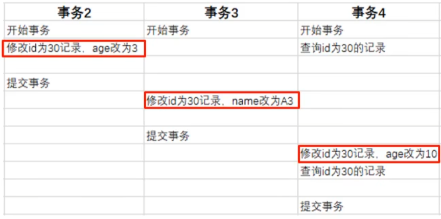
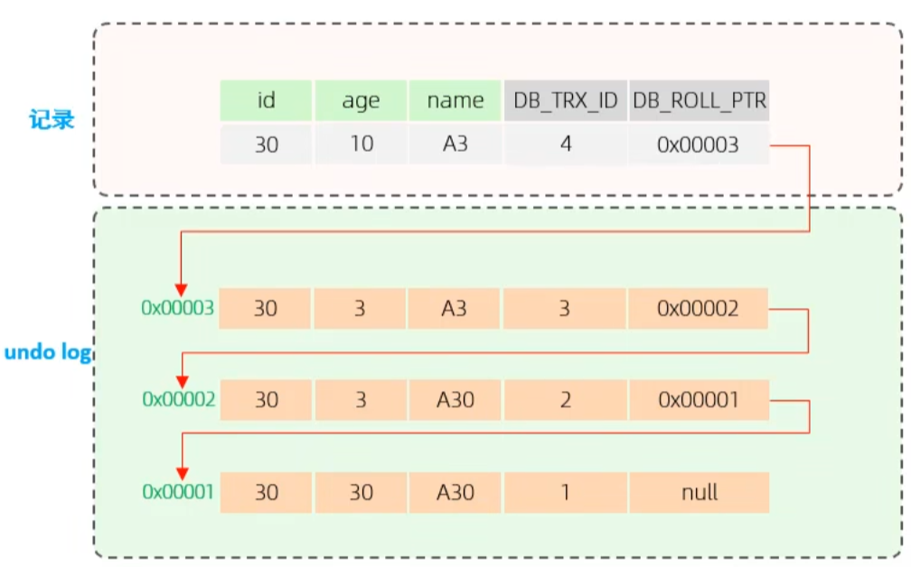
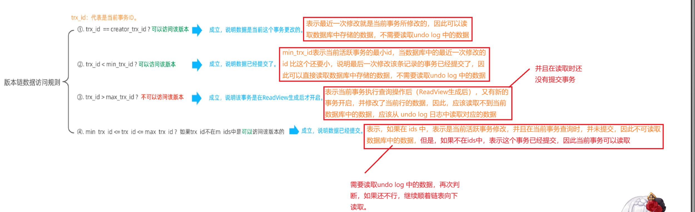

### 1、MVCC-基本概念

- 当前读

    - 读取的时记录的**最新版本**，读取时还要保证其他并发事务不能修改当前记录，会对读取的记录进行加锁，对于我们日常的操作，如：

      select … lock in share mode(共享锁)，等就是一种当前读。

- 快照读

    - 简单的 select(不加锁) 就是快照读，快照读的就是记录的可见版本，有可能是历史版本，不加锁，是非阻塞读。
        - `Read Committed（读已提交）`：每次 `select`都生成一个快照
        - `Repeatable Read（可重复读）`：开启事务后的第一条`select`语句就是快照读，后续的`select`语句读取的就是第一次的快照因此才实现的可重复读。
        - `Serializable`：快照读会退化为当前读

- MVCC

    - 全称 `Multi-Version-Concurrency Contry`，多版本并发控制。指维护一个数据的多个版本，使得读写操作没有冲突，快照读为MySQL实现MVCC提供了一个非阻塞读功能。MVCC的具体实现，还需要依赖于数据库记录中的三个隐式字段、undo log 、readView

### 2、MVCC-实现原理

- 记录中的隐藏字段

    - `DB_TRX_ID`：最近修改事务ID，记录插入这条记录或最后一次修改该条记录的事务ID。
    - `DB_ROLL_PTR`：回滚指针，指向这条记录的上一个版本，用于配合undo log，指向上一个版本。
    - `DB_ROW_ID`：隐藏主键，如果表结构没有指定主键，将会生成该隐藏字段。

  > 在 MySQL 中可以使用 ibd2sdi xxx.ibd 来查看ibd文件

- undo log

    - 回滚日志，在insert、update、delete 的时候产生的便于数据回滚的日志。

      当`insert`的时候，产生的undo log 日志只在回滚时需要，在事务提交后，可被立即删除。而`update、delete` 的时候产生的日志，不仅在回滚的时候需要，在快照读时也需要，不会被立即删除。

- undo log 版本链

  不同事务或相同事务对同一条记录进行修改，会导致该记录的undo log 产生一条记录版本链，链表的头部是最新的旧记录，链表尾部是最早的旧记录。

- readview
    - `ReadView`(读视图)是 **快照读** ，就是一个**快照**，**在进行快读时生成**，SQL执行时MVCC提取数据的依据，记录并维护系统中当前活跃的事务（未提交）id。
    - 包含四个核心字段
        - `m_ids`：当前活跃的事务id集合
        - `min_trx_id`：最小活跃事务id
        - `max_trx_id`：预分配事务id，当前最大事务id + 1
        - `creator_trx_id`：ReadView 创建者 id，**每个快照读都会生成一个ReadView视图，因此都有一个对应的 creator_trx_id也即是当前事务的 id，这个字段只是存一下而不是生成，每个事务开始时，都生成自己对应的id**
    - 具体的undo log 数据链访问规则。
        - 首先明确 `trx_id`：就是数据库中该行数据的隐藏字段 `DB_TRX_ID` 的值。

    - 生成时机：
    - `Read Committed（读已提交）`：在事务中，每次执行快照读，都会生成
    - `Repeatable Read（可重复读）`：仅在第一次快照都时生成，后续复用（**注意：这里复用的只是ReadView，而不是数据，因为后续如果两次查询中间本事务修改了，也会读取到本事务修改后的数据，因为第一条规则**），因为只有第一次时快照读，同时，如果在两次查询中间修改了该条数据，由于第一条匹配规则，还是会读取当前事务所修改的记录，而不是旧的数据(**有解释一遍**)。 