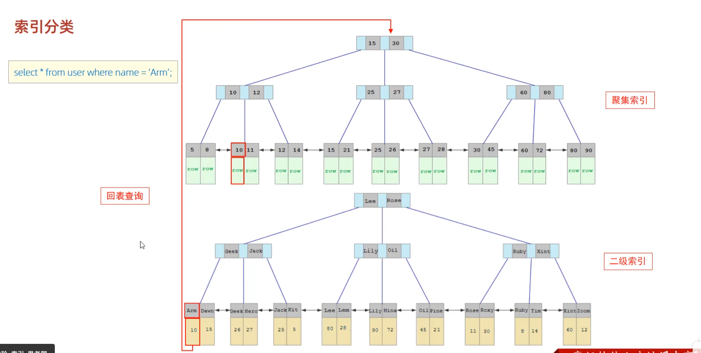
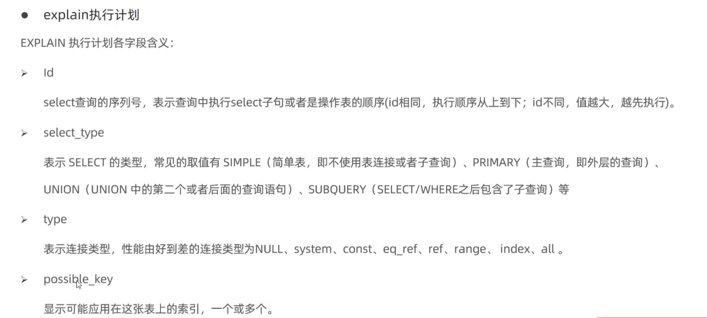
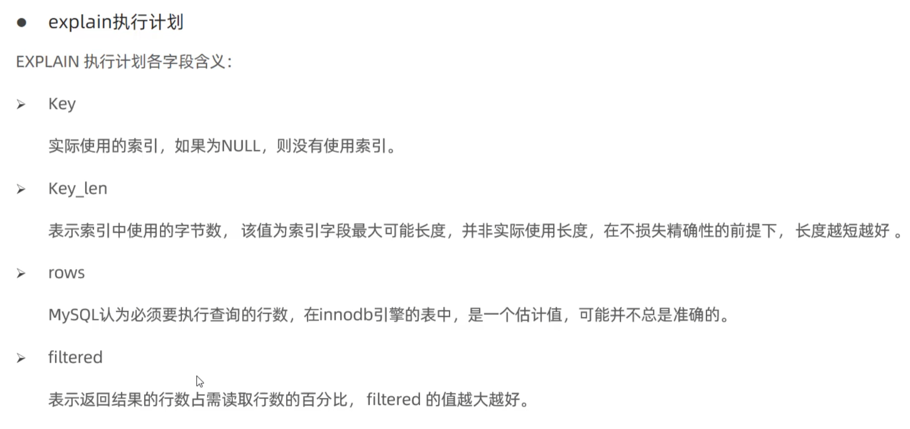

### 1、索引概述：

**索引**是一种有序的数据结构，用于高效的查询数据。（可以举个例子：集合查字典是通过目录查询（索引查询）还是一页一页翻（全表扫描））

**优点：**提高检索效率，降低IO成本。通过索引排序(B+树具有天然的有序性，按索引键值**顺序存储**，当遇到排序时，直接按照链表遍历输出即可，不需要CPU参与排序)，降低CPU的消耗。

**缺点：**索引也会占用存储空间，并且在插入和删除数据时，需要维护索引结构。

### 2、索引数据结构：

#### 0、B+Tree 的结构：

​     ① B+树的结点主要分为两类：

​         1）内部节点：主存储索引键和指向结点的指针，不存储实际数据，每个内部结点包含k个键和k+1个子指针，键用于划分子节点的区间。

​          2）叶子结点：存储完整的键值对，或指向数据的指针，并通过双向链表按**顺序**连接。

​     ② 核心设计：

​          1）数据与索引分离：内部节点存储索引键，子节点存储实际的数据，单个节点可容纳多个值，有效的降低树的高度。

​          2）叶子节点链表化，形成有序的线性结构，显著的提升了范围查询，排序等的效率。

​          3）所有叶子节点位于同一层级，因为所有查询必须到达叶子节点，查询时间稳定为log(n)

#### 1、为什么采用B+树结构：

- **hash表**：使用唯一的key查询value，时间复杂度为 O(1) ，很快，但是没有办法做范围查询，也没办法排序。
- **二叉排序树**：左节点小于根，右节点大于根，中序遍历就是有序的，可以排序，也可以范围查询，但是在顺序插入时，会退化为链表导致查询性能变的很差。
- **平衡二叉树**：在插入节点时采用旋转操作，让二叉树保持平衡，左右子树的高度差不大于 1，能避免极端情况下退化为链表，但是由于平衡二叉树追求绝对的平衡，所以在插入，删除数据时，会频繁的左旋右旋保持平衡，在数据库中，频繁的旋转就会带来大量的磁盘IO，降低性能。
- **红黑树**：也是在插入删除元素时，会通过变色，旋转操作让二叉树保持平衡，但是由于不追求绝对的平衡，只要大致平衡就行了，这样就大大降低了插入，删除时需要的平衡操作，对于数据库来说，就是减少了磁盘的IO，但是红黑二叉树是一种二叉树，一个节点只能由两个子节点，当数据量大的时候，树高就会很高，查询数据时要进行较多的磁盘IO，因此对于少量数据查询效率高，而对于大量数据时，红黑树的查询性能比较低。
- **B树**，B树多路平衡排序树，一个节点有n个子节点，数据量大的情况下，树高也比较低，但是，B树的节点既存数据，也存索引，因此一个节点能存储的索引比较少，当数据量大的时候，树高就会很高，并且B树做范围查询时，需要回溯树结构，会产生很多的随机IO，查询效率较低。而且B树的查询效率不稳定，对于较低层的结果查询效率快，较高层的结果查询效率慢。
- **B + 树**，也是多路平衡排序树，而且B+树的非叶子节点只存索引值，不存数据，因此单个节点能存的索引就变多了，树的高度更低，查询性能更好，而且B+树的数据都存在叶子节点，并且数据都有双向链表连接，范围查询时，只需要遍历链表，不用回溯树结构。

### 3、索引分类：

#### 1、在innoDB中储存引擎中可分为两种

**注意：底层结构都是B+Tree，只不过是叶子节点的数据不同**

- 唯一索引（了解）：不可重复
- 全文索引（了解）：类似于ES的倒排索引

- 聚集索引：将**数据与索引放到一块**存储，索引结构的**叶子节点保存行数据**。必须有，而且**只能有一个**。

    - 聚集索引的选取规则：
        - 如果存在主键，主键索引就是聚集索引。
        - 如果不存在主键，将使用第一个唯一索引作为聚集索引。
        - 如果表中没有主键，或者没有适合的唯一索引，则innoDB会自动生成一个rowid作为隐藏的聚集索引。

- 非聚集索引（二级索引）：将**数据与索引分开存储**，索引结构的**叶子节点关联的时对应的主键**。因此，查询时，会先查到主键索引，再回表查询到具体的数据。

- 查询流程：

#### 2、查询二级索引时一定要回表查询吗？

不是。如果只查询id，二级索引树的结点就有id，就不用回表查询了，也就是当一个索引包含所有需要查询的值的时候，就不需要回表查询了，这种**情况**就是**覆盖索引**，而减少回表查询，就是尽可能地做到覆盖索引，如果一个索引列有多个字段，就能增加覆盖索引地概率，这种索引就是**联合索引**，所谓联合索引就是对表中地多个字段创建索引。

### 4、索引语法

```mysql
-- 创建索引：[唯一索引|全文索引] index 索引名 on 表名 (字段名1,字段2,...)
-- 索引表的名称一般为：idx_表名_字段名
create [UNIQUE|FULLTEXT] index index_name on table_name (index_col_name,...);
-- 查看索引
show index from table_name
-- 删除索引
drop index index_name on table_name
```

### 5、SQL性能分析

```mysql
-- 查看数据库所有语句的执行频次：session表示当前会话的，global表示全局
show [session|global] status like 'Com_______';
-- 慢查日志
	-- 查看慢查询日志是否开启
	show variables like 'slow_query_log';
	-- 开启MySQL慢日志查询开关
	slow_query_log=1
	-- 设置慢日志的时间为2秒，SQL语句执行时间超过2秒，就会被视为慢查询，记录慢查询的日志。
	long_query_time=2
-- profiling
	-- 查看当前数据库是否支持
	select @@have_profiling
	-- 是否开启
	select @@profiling
	-- 开启
	set profiling=1
	-- 查看
	show profiles
-- explain 查看搜索的执行情况
	explain select * from user;
```


**对type字段的解释：**

- `NULL`：通常是不需要查表，而是直接计算得出

- `system`：表示数据只有一行，是 `const` 的一种特例

- `const`：表示常量级别查询，常见用于 主键、唯一索引的**等值查询**

- `eq_ref`：表示唯一索引扫描，常用于 主键、唯一索引的**等值查询**，通常用于 `join`操作，当条件中的列是唯一索引时才用。

- `ref`：非唯一索引扫描，返回匹配值的所有行

- `range`：范围扫描，表示使用索引的一部分

- `index`：全索引扫描，表示不需要回表查询，直接扫描完后直接返回（**索引储存的字段就是要查询的字段**）

- `all`：全表扫描


### 6、索引的使用

#### 1、最左前缀法则：

​      如果索引了多列，（联合索引），要遵循最左前缀法则，指的是查询从索引的最左列开始，并且不跳过索引中的列。如果跳过了某一列，索引将部分失效（后面的字段索引也失效）

>    基本原理就是：联合索引有多个索引列，因此排序地时候会**根据索引列的顺序**去排序，查找的时候会根据**索引列的顺序从左到右依次匹配**
>
>    就是如果一个索引表关联了多个字段，那末，查询时必须包含最左边的字段时，索引才生效，否则，索引不生效。如果关联的是三个字段，如：A B C 那么，在查询时，如果where A=’‘，B= ’‘，C= ’‘ ；索引生效，如果B = ’‘，C=’‘。索引失效，**因为B,C是建立在A的有序的基础上**，不存在A，后面B,C就是乱序的，如果：A=’‘，C=’‘；A索引生效，C索引失效；应为C是建立在B上的，如果 C B A 也走索引，而且全部生效，因为MySQL的优化器会自动把索引列进行重排序。

#### 2、最左前缀法则的应用

- 范围查询：如果使用了> 或 < 的字段，则其后面的索引失效，但是，如果使用的是 >= 或 <= 则不失效。

- 索引运算：如果索引字段进行函数运算，则索引失效

- 字符串不加单引号：字符串不加 ‘ ’ 则索引失效

- 模糊查询：尾部模糊（后面加%）查询走索引，后面模糊（前面加%）不走索引
- or：or 连接的索引，如果前面有索引，后面没索引，那么索引失效，应为不能同时做索引扫描和全表扫描。解决：给字段建立索引。

- 数据分布：如果Mysql判断，走全表扫描快还是走索引快，那个快用哪个。
- 覆盖索引：覆盖索引就是只查询二级索引，就能查出来需要的字段，不需要回表查询select 后不要写 * 要写需要的字段
- 前缀索引：在处理比较长的索引的时候。语法：`create index idx_xxxx on table_name(column(n))`表示我要将字符串的一部分前缀建立索引从而节省索引的空间。通过数据的 字段不重复的记录数 / 总记录数 的值，如果越接近 1 ，就越好。

#### 3、SQL提示

1、`use index(索引名)` ：可以用哪个索引

2、`ignore index(索引名)` ：忽略哪个索引

3、`force index(索引名)` ：必须使用哪个索引

`select * from china_zipcode use index();`

#### 4、为什么不能全部加上索引

索引过多，索引所占用的内存也会增多，并且在增加或删除数据是，需要维护的索引结构就会很多，降低增删改的性能。一般最多不要超过 5 个